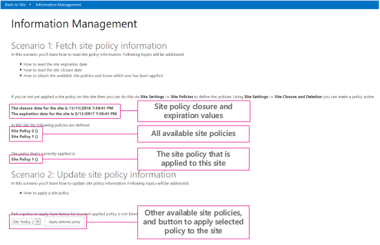

# Information management sample app for SharePoint
As part of your Enterprise Content Management (ECM) strategy, you can get or set site policies to manage the lifecycle of your SharePoint site.

    
 _**Applies to:** Office 365 | SharePoint 2013 | SharePoint Online_

    
The [Core.InformationManagement](https://github.com/OfficeDev/PnP/tree/dev/Scenarios/Core.InformationManagement) sample shows you how to use an ASP.NET provider-hosted SharePoint app to get and set a site policy on a site. Use this solution if you want to:
    

- Apply policy settings during your custom site provisioning process. 
    
- Create a new or modify an existing site policy.
    
- Create a custom expiration formula. 
    
 **Contribute to this content**

    

## Before you begin
<a name="sectionSection0"> </a>

To get started, download the  [Core.InformationManagement](https://github.com/OfficeDev/PnP/tree/dev/Scenarios/Core.InformationManagement) sample app from the [Office 365 Developer patterns and practices](https://github.com/OfficeDev/PnP/tree/dev) project on GitHub.

We recommend that you create at least one site policy, and assign it to your site before you run this app. Otherwise, the app will start without displaying sample data. For more information, see  [Overview of site policies in SharePoint 2013](http://technet.microsoft.com/en-US/library/jj219569%28v=office.15%29.aspx).


## Using the Core.InformationManagement sample app
<a name="sectionSection1"> </a>

When you start the app, the start page displays the following information, as shown in Figure 1:


- The site's closure and expiration dates. These dates are specific to a site and are based on the configuration settings of the site policy that is applied.
    
- All site policies that can be applied to the site.
    
- The site policy that is currently applied.
    
- The option box to select and apply a new site policy to the site.
    

**Figure 1. Information Management app start page**



From your SharePoint site, you can go to the app, which runs on the remote host, by choosing  **Recent** > **Core.InformationManagement**. To return to your SharePoint site, choose  **Back to Site**.

The Pages\Default.aspx.cs file in the Core.InformationManagementWeb project contains the code for the page displayed in Figure 1. 

The following code in the  **Page_Load** method of the Default.aspx.cs page fetches and displays the closure and expiration dates of the site, based on the applied site policy. This code calls the **GetSiteExpirationDate** and **GetSiteCloseDate** extension methods of the OfficeDevPnP.Core project.


    
**Note**  The code in this article is provided as-is, without warranty of any kind, either express or implied, including any implied warranties of fitness for a particular purpose, merchantability, or non-infringement.


```C#
// Get site expiration and closure dates.
if (cc.Web.HasSitePolicyApplied())
{
        lblSiteExpiration.Text = String.Format("The expiration date for the site is {0}", cc.Web.GetSiteExpirationDate());
        lblSiteClosure.Text = String.Format("The closure date for the site is {0}", cc.Web.GetSiteCloseDate());
}

```

The following code in the  **Page_Load** method of the Default.aspx.cs page displays the names of all site policies that can be applied to the site (including the currently applied site policy). This code calls the **GetSitePolicies** extension method of the OfficeDevPnP.Core project.


```C#
// List the defined policies.
List<SitePolicyEntity> policies = cc.Web.GetSitePolicies();
string policiesString = "";
foreach (var policy in policies)
                    {
                        policiesString += String.Format("{0} ({1}) <BR />", policy.Name, policy.Description);
                    }
lblSitePolicies.Text = policiesString;
            };

```

The following code in the  **Page_Load** method of the Default.aspx.cs page displays the name of the site policy currently applied to the site. This calls the **GetAppliedSitePolicy** extension method of the OfficeDevPnP.Core project.


```C#
// Show the assigned policy.
SitePolicyEntity appliedPolicy = cc.Web.GetAppliedSitePolicy();
if (appliedPolicy != null)
            {
            lblAppliedPolicy.Text = String.Format("{0} ({1})", appliedPolicy.Name, appliedPolicy.Description);
            }
else
            {
            lblAppliedPolicy.Text = "No policy has been applied";
            }

```

The following code in the  **Page_Load** method of the Default.aspx.cs page populates the drop-down list with the site policies that are available, except for the site policy that is currently assigned to the site.


```C#
// Fill the policies combo.
foreach (var policy in policies)
{
if (appliedPolicy == null || !policy.Name.Equals(appliedPolicy.Name, StringComparison.InvariantCultureIgnoreCase))
{
                            drlPolicies.Items.Add(policy.Name);
           }
}
btnApplyPolicy.Enabled = drlPolicies.Items.Count > 0;


```

The following code in the Default.aspx.cs page applies the selected site policy to the site. The original site policy is replaced by the new site policy. 


```C#
protected void btnApplyPolicy_Click(object sender, EventArgs e)
{
if (drlPolicies.SelectedItem != null)
            {
                cc.Web.ApplySitePolicy(drlPolicies.SelectedItem.Text);
                Page.Response.Redirect(Page.Request.Url.ToString(), true);
            }
}

```


## Additional resources
<a name="bk_addresources"> </a>


-  [Enterprise Content Management solutions for SharePoint 2013 and SharePoint Online](https://msdn.microsoft.com/en-us/library/dn904530(v=office.15).aspx)
    
-  [OfficeDevPnP.Core sample](https://github.com/OfficeDev/PnP/tree/master/OfficeDevPnP.Core)
    
-  [Core.SiteClassification sample](https://github.com/OfficeDev/PnP/tree/master/Scenarios/Core.SiteClassification)
    
-  [ECM.AutoTagging sample app](https://github.com/OfficeDev/PnP/tree/dev/Scenarios/ECM.AutoTagging)
    
-  [ECM.DocumentLibraries sample app](https://github.com/OfficeDev/PnP/tree/dev/Scenarios/ECM.DocumentLibraries)
    
-  [ECM.RecordsManagement sample app](https://github.com/OfficeDev/PnP/tree/dev/Scenarios/ECM.RecordsManagement)
    
