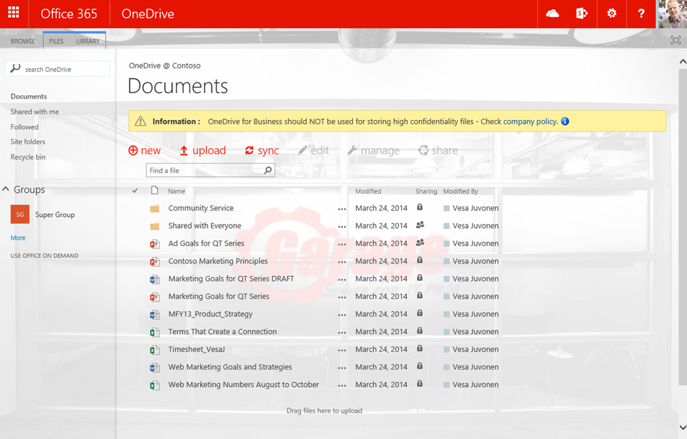
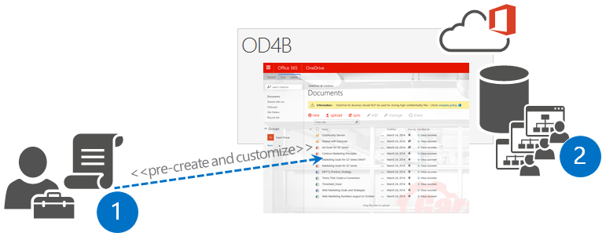
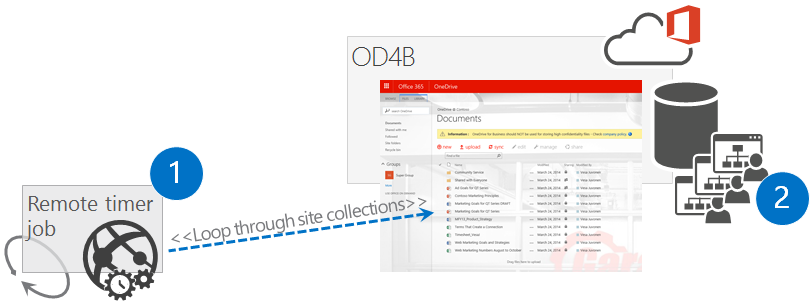
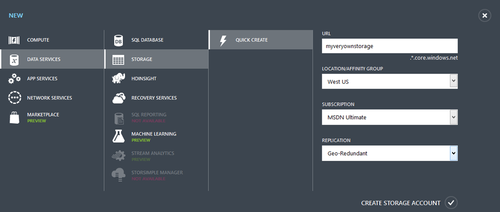
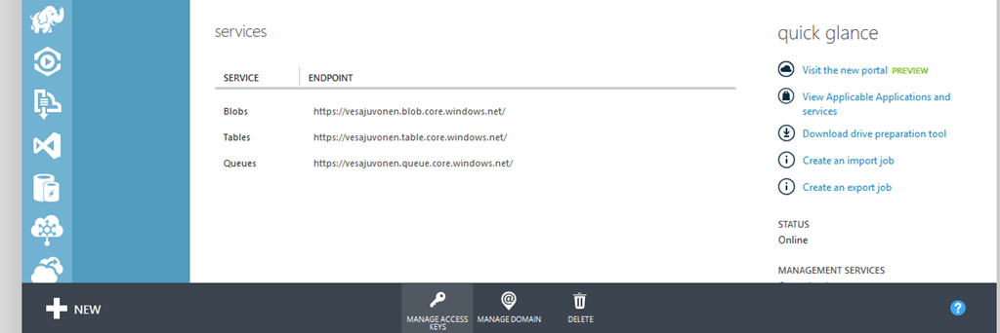
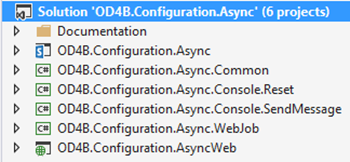
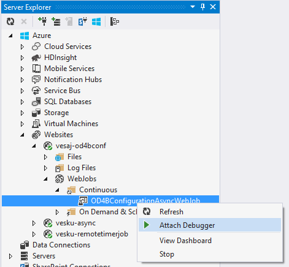
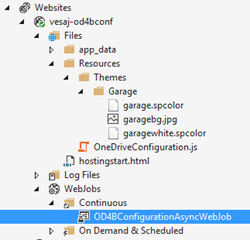

OneDrive for Business customization in the SharePoint add-in model
==================================================================

Summary
-------

The approach you take to customize OneDrive for Business sites in the new SharePoint Add-in model is different than it was with Full Trust Code.  In a typical Full Trust Code (FTC) / Farm Solution scenario, SharePoint Timer Jobs were created with the SharePoint Server Side Object Model code, deployed via Farm Solutions and managed in the SharePoint Central Administration web site.  SharePoint handles both the scheduling and the execution of the timer job in this scenario. 

In an SharePoint Add-in model scenario, timer jobs are created and scheduled outside of SharePoint.  SharePoint is not responsible for the scheduling or the execution of the timer job in this scenario.

Why would you customize OneDrive for Business sites?
----------------------------------------------------
There are numerous different aspects on applying customization to OneDrive for Business (OD4B) sites. You certainly can customize these sites, since they are SharePoint sites, but at the same time you should always consider the short and long term impact of the customization.

High Level Guidelines
---------------------

As a rule of a thumb, we would like to provide the following high level guidelines for customizing OD4B sites.

- Apply branding customization using Office 365 themes or SharePoint site theming engine
- If theme engines are not enough, you can adjust some CSS settings using alternate CSS option
- Avoid customizing OD4B sites using custom master pages, since this will cause you additional long term costs and challenges with future updates
	+ In most of the cases, you can achieve all common branding scenarios with themes and alternate CSS, so this is not really that limiting factor
	+ If you chose to use custom master pages, be prepared on applying changes to the sites when major functional updates are applied to Office 365
- You can use JavaScript embedding to modify or hide functionality in the site
- You can use CSOM to control for example language or regional settings in the OD4B sites (see [new APIs](http://blogs.msdn.com/b/vesku/archive/2014/12/15/latest-api-updates-in-client-side-object-model-dec-2014-cu-for-sp2013.aspx))
- We do not recommend usage of content types and site columns in OD4B sites to avoid challenges with the required fields or other elements, which could cause issues for normal use cases with OD4B sites
	+ Think OD4B sites as for personal unstructured data and documents. Team sites and collaboration sits are then for company data and documents where you can certainly use whatever information management policies and metadata you want.

As a summary, customization is definitely supported in Office 365 and you can keep on using them with OD4B sites. We just truly want to ensure that you consider the short and long term impact of the customization from operational and maintenance perspective. This is not really specific for SharePoint, rather a rule of thumb for any IT solution build with any platform.

Here’s an example of OD4B site, which has been customized using above guidelines. In this case the end result has been achieved with combination of Office 365 themes, site theme and usage of so called JavaScript embedding pattern.

Challenge with applying OneDrive for Business site customizations
-----------------------------------------------------------------

Let’s start with defining what is the challenge and what are we trying to solve here. Technically each OneDrive for Business site is currently using identical architecture as what the personal or my sites used  back in SharePoint 2007 or 2010 version. This means that technically each OneDrive for Business site is their own site collection and we do not have any centralized location to apply branding or any other customizations.

Classic solution to apply needed configuration to the OneDrive for Business sites (including my or personal sites) was based on [feature stapling in farm level](http://cks.codeplex.com/releases/view/2824). This meant that you deployed farm solution to your SharePoint farm and used feature framework to associate your custom feature to be activated each time a my site is crated, which was then responsible of applying needed customizations. This similar approach does not work in Office 365, since it requires farm solution to be deployed and that is simply impossible with Office 365 sites. Therefore we need to look alternatives to apply the needed changes to the sites.

In Office 365 there is no centralized event raised, which we could attach our custom code to when OD4B site is created. This means that we need to think about alternative solutions, which is quite common with app model approaches. Do not get stuck on old models, think about how to achieve same end result using new APIs and technologies. From pure requirement perspective, it does not really matter how we apply the customizations to the sites, as long as they are applied, since business requirement is not to use feature stapling, it’s about applying needed customizations using whatever supported technical mechanism.

Different options for applying customization
============================================

In practice we do have four different mechanisms to apply centralized customization to OD4B sites in the Office 365. You could also consider manual option as the fifth one, but in the case of having hundreds or thousands of OD4B sites, using manual options is not really a realistic option. Here’s the different options we have.

1. Office 365 suite level settings (Office 365 themes and other settings)
2. Hidden app part with user context
3. Pre-create and apply configuration
4. Remote timer job based on user profile updates

Each of the options have advantages and disadvantages in them and the right option depends on your detailed business requirements. Some of the settings you can also apply from the Office 365 suite level, but often you would be looking for some more specifics, so actual customizations are needed. It obviously all comes down on exact requirements and business case analyses on their impact on short and long term.

Office 365 suite level settings
-------------------------------

Office 365 is much more than just SharePoint, like you know. You can find more and more additional services which are not based on even the SharePoint architecture, like Delve, Yammer and many upcoming services. This means that the enterprise branding and configuration is not just about controlling what we have in the SharePoint sites, rather we should be thinking the overall end user experience and how we provide consistent configurations cross different services.

Classic example of these enterprise requirements is branding and for that we have already Office 365 theming introduced, which can be used to control some level of branding. We have also other upcoming features, which will help to control your site governance and other settings, from centralized location outside of the site collection settings, like the upcoming Compliance Center for Office 365, which is currently listed in the [Office 365 roadmap](http://office.microsoft.com/en-us/products/office-365-roadmap-FX104343353.aspx).

Following picture shows the different settings right now for the Office 365 theming, which will be then applied cross all Office 365 services.

Since by default Office 365 theme settings are for controlling OD4B site suite bar, you will most likely be using this options together with other options to ensure that you can provide at least the right branding elements cross your OD4B sites. Notice that when you change for example Office 365 theme settings in Office 365 admin tool, it does take a quite a long time to get the settings applied for OD4B sites, so be patience.

Hidden app part with user context
---------------------------------

This is an approach where use centralized landing page as the location for starting the needed customization process. This means that you would have to have one centralized location, like company intranet front page, where the users are always landing when they open up their browser. This is pretty typical process with midsized and larger enterprises where corporate landing page is then controlled using group policy settings in the AD. This will ensure that end users cannot override default welcome page of the company domain joined browsers.

When user arrives to the intranet, we will have hidden app part in the page, which will start the customization process. It can actually be responsible of the whole OD4B site creation as well, since normally user would have to visit the OD4B site once time, before the site creation process will be started. Hidden app part is actually hosting a page from provider hosted app hosted in Azure. This page is then responsible of starting the customization process.

Let’s have a closer look on the logical design of this approach.

1. Place hidden app part to centralized site where end users will land. Typically this is the corporate intranet front page.
2. App part is hosting a page from provider hosted app, where in the server side code we initiate the customization process by adding needed metadata to the azure storage queue. This means that this page will only receive the customization request, but will not actually apply any changes to keep the processing time normal.
3. This is the actual azure storage queue, which will receive the messages to queue for processing. This way we can handle the customization controlling process asynchronously so that it does not really matter how long end user will stay on the front page of the Intranet. If the customization process would be synchronous, we would be dependent on end user to keep the browser open in the Intranet front page until page execution is finalized. This would not definitely be optimal and it was the challenge with the [original OD4B customization process](http://blogs.msdn.com/b/vesku/archive/2013/11/25/office365-apply-automatically-custom-branding-to-personal-site-skydrive-pro.aspx), which I blogged while back.
4. WebJob hooked to follow the storage queue, which is called when new item is placed to the storage queue. This WebJob will receive the needed parameters and metadata from the queued message to access right site collection. WebJob is using app only token and have been granted the needed permissions to manipulate site collections in the tenant level.
5. Actual customizations are applied one-by-one to those people’s sites who visit the intranet front page to start the process.
This is definitely the most reliable process of ensuring that there’s right configurations in the OD4B sites. You can easily add customization versioning logic to the process, which is also applying any needed updates to the OD4B sites, when there is an update needed and user visits the Intranet front page next time. This option does however require that you have that centralized location where your end users are landing.

If you are familiar of classic SharePoint development models with farm solutions, this is pretty similar process as one time executing timer jobs.

Pre-create and apply configuration
----------------------------------

This option relies on the pre-creation of the OD4B sites before users will access them. This can be achieved by using [relatively new API](https://github.com/OfficeDev/PnP/tree/master/Samples/Provisioning.OneDriveProvisioning) which provides us away to create OD4B sites for specific users in batch process, using either CSOM or REST. Needed code can be initiated using a PowerShell script or by writing actual code which is calling the remote APIs.

1. Administrator is using the remote creation APIs to create OD4B sites for users and is applying the needed customizations to the OD4B sites as part of the script process.
2. Actual OD4B sites are created to the Office 365 for specific users and associated to their user profiles

In some sense this is also really reliable process, but you would have to manage new persons and updates “manually”, which could mean more work then using the *hidden app part* approach. This is definitely valid approach which can be taken and especially useful if you are migrating from some other file sharing solution to the OD4B and want to avoid the need of end users to access the OD4B site once, before actuals site creation is started.

Remote timer job based on user profile updates
----------------------------------------------

This approach means scanning through user profiles for checking to whom the OD4B site has been created and then apply the changes to the sites as needed. This would mean scheduled job running outside of the SharePoint, which will periodically check the status and perform needed customizations. Scheduled job could be running as a WebJob in Azure or as simple as PowerShell script scheduled in your own windows scheduler. Obviously the scale of the deployment has huge impact on the chosen scheduling option.

1. Scheduled task is initiated which will access user profiles of the users for checking who has OD4B site provisioned
2. Actual sites are customized one-by-one based on the business requirements

One of the key downsides of this option is that there can clearly be a situations where user can access the OD4B sites before the customizations have been applied. At the same time this option is interesting add-on for other options to ensure that end users have not changed any of the required settings on the sites or to check that the OD4B site content aligns with the company policies.

Enhanced app part based customization
-------------------------------------

Here's more detailed description of enhanced app part based customizations, which seems to be the typical approach for applying and managing needed customizations to the OD4B sites. Source code and additional details on this solution is available from the [Office 365 Developer Patterns and Practices guidance](http://aka.ms/officedevpnp).

Actual logical design follows the hidden app part approach, mentioned before in [this blog post](http://blogs.msdn.com/b/vesku/archive/2013/11/25/office365-apply-automatically-custom-branding-to-personal-site-skydrive-pro.aspx). This means that the assumption is that you have centralized Intranet in the office 365 environment where you can put the needed app part and that the end users will be landing to this welcome page when they open up their browser. It is common that each company browser will have same home page set using group policies, so that end users will always start from one centralized location when they open up their browser. This is the location where you’d put app part, which can be set to be sized as 0 pixel width and height. Key point here is that you use the end user context to execute the app part, which contains page from the provider hosted add-in.

**Performance optimization and maintenance considerations**

Since this app part will be executed each time user lands to front page of the intranet, we need to consider the performance impact of this or how to make the code to work efficiently and only perform key parts of the code executions when truly needed. Second optimization consideration is also where do we place actual assets which are used in each of the sites. These are pretty typical challenges to tackle with any customizations. Here’s short list of things to concentrate in app model implementations.

- Location of the assets – centralized content delivery network (CDN) solution, in each site collection or in root site collection?
- Refresh rate of the assets or how to ensure that regardless of client side browser caching we can ensure that we execute latest versions of the scripts (JavaScript) or show the latest versions of the images?
- Reduced execution of code to avoid unnecessary load to Azure and Office 365 service
- Version customizations which are applied to OD4B site

**Location of the assets**

There are few different solutions for this. In the reference code example we use JavaScript embedding in each of the OD4B sites to provide company policy message and to remove the possibility to create sub sites (or hide the link). In this particular solution we are uploading the needed JavaScript file to root site collection of the OneDrive for Business address scheme and we reference that file directly from that one location in the individual OD4B sites. This means that you only have one location to maintain and update the JavaScript file, if any changes are needed.

In this reference implementation we actually also refresh this file each time the WebJob is executed, which is certainly not needed, but sample code was meant to be working as easily without any additional steps and possible. Just as well you could upload the JavaScript file manually to root site collection and then reference that from there. Alternative solution would be also to use some CND to store the needed file or reference JavaScript from the provider hosted app side. As long as you have only one copy of the file, you will have

**Client side caching challenge and how to solve that**

One of the challenges with JavaScript based implementation is client side caching. When browsers will download used JavaScript files, they will cache those files to reduce the amount of downloaded assets for following requests. This is great from performance optimization perspective, but causes a challenge when we need to update the JavaScript file. In worst case scenario, cached JavaScript file will cause exceptions with other updates introduced with updated versions.

To remove this issue, we can start using revision attribute with JavaScript URL reference. When we associate user custom action to the OD4B site, we include the URL of the JavaScript to have unique GUID in the URL. Here’s example of the reference which will be pointing to the root site of the site collection. Notice the additional GUID which has been added after the rev attribute in the URL. Each time the customizer will be executed for particular OD4B site, this attribute will be update. In practice this means that JavaScript file is cached to browser until there is a new version added to OD4B site, which will change the URL and therefore browser will download the new version and will cache that after the next update.

- /OneDriveCustomization/OneDriveConfiguration.js?rev=4bb89029e7ba470e893170d4cba7de00

Here’s the code which is used to generate the JavaScript URL for the user custom action.
	
	/// 

    /// Just to build the JS path which can be then pointed to the OneDrive site.
    /// 

    /// <returns></returns>
    public string BuildJavaScriptUrl(string siteUrl)
    {
        // Solve root site collection URL
        Uri url = new Uri(siteUrl);
        string scenarioUrl = String.Format("{0}://{1}:{2}/{3}", 
                               url.Scheme, url.DnsSafeHost, 
                               url.Port, JSLocationFolderName);
       // Unique rev generated each time JS is added, so that we force browsers to 
       // refresh JS file wiht latest version
       string revision = Guid.NewGuid().ToString().Replace("-", "");
       return string.Format("{0}/{1}?rev={2}", scenarioUrl, JSFileName, revision);
    }

**Reduced execution of code**

Since this process is based on having hidden app part on the front page of the Intranet, it will mean that the code will be executed each time user will refresh their browser or they move to the page. Since this front page is often set as the default browser home page for the corporate users, code would be executed each time a browser session is started.

Since we do not however update the customizations which are applied to the OD4B sites that often, there’s really no point starting the whole customization update process in first place. By doing this, we reduce the usage of the storage queues and the web job execution, which will directly reduce the costs associated on the provider hosted app side, since we will not use as much CPU and other resources in our design.

Easiest way to ensure that our processing is not performed in each request is to use classic browser cookie approach, where we will store specific cookie to client browser with specific life time. By checking this cookie existence, we can skip the execution, until the cookie has been expired and that’s when we re-check the actual customization status in the OD4B sites.

Here’s what we have in the page load method for the app part. This method call will check existence of the cookie and if the cookie does exist, we will skip the actual business code until execution is again needed.

 	// Check if we should skip this check. We do this only once per hour to avoid 
    // perf issues and there's really no point even hitting the user profile 
    // in every request.
    if (CookieCheckSkip())
        return;

Actual cookie status and setting of the cookie is done as follows.

	/// 

    /// Checks if we need to execute the code customization code again. 
    /// Timer set to 60 minutes to avoid constant execution of the code for nothing.
    /// 

    /// <returns></returns>
    private bool CookieCheckSkip()
    {
        // Get cookie from the current request.
        HttpCookie cookie = Request.Cookies.Get("OneDriveCustomizerCheck");
    
       // Check if cookie exists in the current request.
       if (cookie == null)
       {
           // Create cookie.
           cookie = new HttpCookie("OneDriveCustomizerCheck");
           // Set value of cookie to current date time.
           cookie.Value = DateTime.Now.ToString();
           // Set cookie to expire in 60 minutes.
           cookie.Expires = DateTime.Now.AddMinutes(60);
           // Insert the cookie in the current HttpResponse.
           Response.Cookies.Add(cookie);
           // Output debugging information
           WriteDebugInformationIfNeeded(
               string.Format(@"Cookie did not exist, adding new cookie with {0} 
                               as expiration. Execute code.",
                               cookie.Expires));
           // Since cookie did not existed, let's execute the code, 
           // so skip is false.
           return false;
       }
       else
       {
           // Output debugging information
           WriteDebugInformationIfNeeded(string.Format(@"Cookie did existed, 
                                       with {0} as expiration. Skipping code.", 
                                       cookie.Expires));
           //  Since cookie did existed, let's skip the code
           return true;
       }
    }

If you have a closer look on the code in the app part page, you’ll see that in every call we do check the existences of the OD4B site for the end user. Since this can be only done by accessing user profile, code will have impact on the performance. By using the above cookie check, we can make the end user experience better and we avoid hitting the user profile service constantly without actual requirements. It’s also good to notice that we have placed that cookie check as the first step in the *Page_Load* method, so that we skip all processing, if needed. Here’s a short snippet from the *Page_Load* method from the *Customizer.aspx* to show the code process. 

	protected void Page_Load(object sender, EventArgs e)
    {
        // Check if we should skip this check. We do this only once per hour to avoid 
        // perf issues and there's really no point even hitting the user profile 
        // in every request.
        if (CookieCheckSkip())
            return;
     
        var spContext = 
           SharePointContextProvider.Current.GetSharePointContext(Context);
       using (ClientContext clientContext = 
           spContext.CreateUserClientContextForSPHost())
       {
           // Get user profile
           ProfileLoader loader = ProfileLoader.GetProfileLoader(clientContext);
           UserProfile profile = loader.GetUserProfile();
           Microsoft.SharePoint.Client.Site personalSite = profile.PersonalSite;
    
           clientContext.Load(profile, prof => prof.AccountName);
           clientContext.Load(personalSite);
           clientContext.ExecuteQuery();
    
           // Let's check if the site already exists
           if (personalSite.ServerObjectIsNull.Value)
           {

**Version customizations which are applied to OD4B site**

Second level of optimization on our code processing is done by versioning specifically the customizations which we deploy to the OD4B sites. What this means is that we store the version of the customizations to the OD4B site property bag and only update the files and assets if needed. This means that in the WebJob execution we compare the currently customization version in OD4B to the version which we are about to deploy and only if the customization version odes not exist in the OD4B site, we upload the needed assets and apply other settings.

This approach will also significantly reduce the needed resources from Microsoft Azure, since we avoid refreshing or executing actual customization code when it’s not needed. This means reduction on the CPU and other resource usage in the Microsoft Azure and less requests towards Office 365.

All customization logic is stored in this sample is located in *ApplySiteConfiguration* method at *OD4B.Configuration.Async.Common.SiteModificationManager* class. This method is also called by the WebJob with right parameters to start the customization process. Before we actually perform any operations, we are checking property bag value with a key of ‘Contoso_OneDriveVersion’ and execution will only continue if current version in the site is lower than the version which we are planning to apply.  Here’s the actual code which is using [Office PnP Core component](https://github.com/OfficeDev/PnP-Sites-Core/tree/master/Core) to simplify the code.

	// Check current site configuration status - is it already in right version?
    if (ctx.Web.GetPropertyBagValueInt(
        SiteModificationManager.OneDriveMarkerBagID, 0) 
        < SiteModificationManager.BrandingVersion)
    {

When customization is applied to the site, we will set the applied customization version to the property bag for following execution.

	// Save current branding applied indicator to site
    ctx.Web.SetPropertyBagValue(SiteModificationManager.OneDriveMarkerBagID, SiteModificationManager.BrandingVersion);

This is relatively simple process, but will significantly reduce the required resources from Azure and will also reduce unnecesasrey remote operations towards Office 365, which will have positive performance impact.

Needed configuration in Azure
-----------------------------

Key requirement for this sample to work properly is that you have created Azure Storage Data Service and you have updated storage connection strings accordingly for the projects, which are using them. You can simply create as storage service from the Azure administration portal (manage.windowssazure.com), by selecting **New –> Data Services –> Storage –> Quick Create**. After this you will just need to define name, location and few other settings and you are good to go.

When storage has been created, you need to go and copy the key which is needed for the connection string. When you move to the storage detail page, you can access key information by clicking “*Manage Access Keys*”  from the bottom of the page.

You will need to update App.config file for following projects in the Visual Studio solution. Each of the projects are more detailed explained later in this blog post.

OD4B.Configuration.Async.WebJob
OD4B.Configuration.Async.Console.SendMessage
WebJob project has two keys, which can be updated to point to the same connection and the SendMessage has only one key to update.

Reference solution structure
----------------------------

This Visual Studio solution consists from quite a few solutions, but each of them have pretty reasonable reason to be there. Here’s introduction to each of the projects in the solution and why they exists or what they are for.

**OD4B.Configuration.Async**

This is the actual SharePoint app project, which will introduce the provider hosted app to SharePoint and will ask the needed permissions. Notice that even though we do not actually perform tenant level operations from the app part it self, we are asking pretty high permissions for the add-in. This is because we will use the same  client ID and secret from this app file in our WebJob execution. Using this approach, you do not have to manually register app id and secret to the SharePoint, we rather just use the same identifier and secret cross solution.

This project also contains the app part definition which will be then deployed to the host web.

**OD4B.Configuration.Async.Common**

This project contains all the actual business logic and shared code cross projects, like the definition for the data object which is placed to the storage queue and the actual business logic to customize OD4B sites. Reason to place code in here is simply for giving us easier way to develop and test the operations when the project is created. Like with general development, you should not really place your business logic code directly to the WebJob or to app part, rather to locate that in business logic layer for easier testing and code reuse.

All the actual operations towards the OD4B sites are located in *OD4B.Configuration.Async.Common.SiteModificationManager* class.

**OD4B.Configuration.Async.Console.Reset**

This project is our test and debugging project for the actual customizations. It can be used to manually apply the wanted customizations to any OD4B site. During development time this project was our testing project to test the customization process before it was hooked to the WebJob. Project can be also used to reset customizations from any OD4B site for demonstration or testing purposes. Since actual business logic is located in the common project, this project will use the same *SiteModificationManager* class as the others to apply or reset customizations from the sites.

When you test the customizations, you can simply change the code in the Main method between Apply and Reset to change the wanted operation.

	static void Main(string[] args)
    {
     
        Uri url = 
            new Uri("https://vesaj-my.sharepoint.com/personal/vesaj_veskuonline_com");
     
            //get the new site collection
        string realm = TokenHelper.GetRealmFromTargetUrl(url);
        var token = TokenHelper.GetAppOnlyAccessToken(
                       TokenHelper.SharePointPrincipal, 
                       url.Authority, realm).AccessToken;
       using (var ctx = 
           TokenHelper.GetClientContextWithAccessToken(url.ToString(), 
           token))
       {
           // Uncomment the one you need for testing/reset
           // Apply(ctx, url);
           Reset(ctx);
       }
    }

Notice that you will need to ensure that app id and secret for this project in the app.config are matching the ones you gave needed permissions to your tenant. You can easily execute the project by right clicking the project and choosing **Debug – Start New Instance**, so that you can walk the actual code which is executed line by line.

**OD4B.Configuration.Async.Console.SendMessage**

This project was added to the solution to test the storage queue mechanism before it was hooked to the app part. Project can be used to by pass the app part process for adding new messages to the storage queue. Notice that you will need to update the storage queue connection string accordingly in the app.config to make the project work properly.

You can easily execute the project by right clicking the project and choosing Debug – Start New Instance, so that you can walk the actual code which is executed line by line.

**OD4B.Configuration.Async.WebJob**

This is the actual WebJob project, which was created using WebJob project template, introduced in the Visual Studio 2013 Update 4. This template makes it easier to create WebJob projects by adding right references in place and it also provides nice deployment automation with right click support for the project. You can simply deploy initial version or new version of the project to the Azure by right clicking and selecting Publish as Azure Web Job… which will open up the publishing wizard.

This WebJob is created as a continuous WebJob, which is needed for the queue based processing. This means that in the Main method, we only set the process to be executing continuous like follows.

	class Program
    {
        // Please set the following connection strings in app.config for this 
        // WebJob to run: AzureWebJobsDashboard and AzureWebJobsStorage
        static void Main()
        {
            var host = new JobHost();
            // The following code ensures that the WebJob will be 
            // running continuously
           host.RunAndBlock();
       }
    }

Actual queue processing is really easy with WebJobs. Only thing we need to do is to set the right attributes for the method and to ensure that the Azure storage connection strings in the app config are updated accordingly and matching the storage queue’s you have created to Microsoft Azure. Following is the *ProcessQueueMessage* method from the functions.cs class. Notice how we use the App Only token model to access the SharePoint from the WebJob. To make this work, you will need to ensure that you have copied the right app id and secret to the app.config of the project. Actual business logic is located in the *SiteModificationManager* class, so we just call that with the right client context and parameters.

	// This function will get triggered/executed when a new message is written 
    // on an Azure Queue called queue.
    public static void ProcessQueueMessage(
        [QueueTrigger(SiteModificationManager.StorageQueueName)] 
        SiteModificationData request, TextWriter log)
    {
        Uri url = new Uri(request.SiteUrl);
     
        //Connect to the OD4B site sing App Only access
       string realm = TokenHelper.GetRealmFromTargetUrl(url);
       var token = TokenHelper.GetAppOnlyAccessToken(
           TokenHelper.SharePointPrincipal, url.Authority, realm).AccessToken;
    
       using (var ctx = TokenHelper.GetClientContextWithAccessToken(
           url.ToString(), token))
       {
           // Set configuration object properly for setting the config
           SiteModificationConfig config = new SiteModificationConfig()
           {
               SiteUrl = url.ToString(),
               JSFile = Path.Combine(Environment.GetEnvironmentVariable
                   ("WEBROOT_PATH"), "Resources\\OneDriveConfiguration.js"),
               ThemeName = "Garage",
               ThemeColorFile = Path.Combine(Environment.GetEnvironmentVariable
                   ("WEBROOT_PATH"), "Resources\\Themes\\Garage\\garagewhite.spcolor"),
               ThemeBGFile = Path.Combine(Environment.GetEnvironmentVariable
                   ("WEBROOT_PATH"), "Resources\\Themes\\Garage\\garagebg.jpg"),
               ThemeFontFile = "" // Ignored in this case, but could be also obviously set
           };
    
           new SiteModificationManager().ApplySiteConfiguration(ctx, config);
       }
    }

Other thing worth noticing is that you will need to ensure that you have set the *Copy Local* property for the SharePoint CSOM assembly references property for the project, so that all dependent assemblies are properly copied to Azure when you deploy the web job. This is simply because these assemblies are not located in normal Azure web site by default, so by setting this property *True*, you will ensure that the referenced assemblies are copied to cloud as well.

**OD4B.Configuration.AsyncWeb**

This is the actual provider hosted app which is hosted in Microsoft Azure. It contains the page laded to the app part, which is placed on the front page of the intranet. Default.aspx page of this app does not actually contain any operations, it shows provides details on how to use the app.

*Notice. If you will face permission denied issues with the WebJob or app only access in general, make sure that you have updated app client id and secret in the app.config to match the values in the web.config from this project. Visual Studio can change these values in certain scenarios.* 

Queue processing in WebJob
--------------------------

Using the storage queues is really straight forward with the APIs available from Azure. Easiest way to get started is to use the '*Windows Azure Storage*' Nuget package, which will associate all needed APIs and other packages to your project. After you have added this Nuget package, you can simply start using the storage queue APIs for the processing. Following is snippet from the *OD4B.Configuration.Async.Common* project (AddConfigRequestToQueue method in SiteModificationManager class), which contains actual queue message handling code and is used from numerous projects (provided easier development time debugging).

	public void AddConfigRequestToQueue(
                string account, string siteUrl, string storageConnectionString)
    {
        CloudStorageAccount storageAccount = 
                            CloudStorageAccount.Parse(storageConnectionString);
     
        // Get queue... create if does not exist.
        CloudQueueClient queueClient = storageAccount.CreateCloudQueueClient();
        CloudQueue queue = 
           queueClient.GetQueueReference(SiteModificationManager.StorageQueueName);
       queue.CreateIfNotExists();
    
       // Pass in data for modification
       var newSiteConfigRequest = new SiteModificationData()
       {
           AccountId = account,
           SiteUrl = siteUrl
       };
    
       // Add entry to queue
       queue.AddMessage(
           new CloudQueueMessage(
               JsonConvert.SerializeObject(newSiteConfigRequest)));
    }

Actual queue processing in this case was done with the WebJob project. In the case of WebJob, we can simply use specific attributes to automate the queue handling. Only thing we need to make sure is that we are using same storage connection string and queue name in both sending and receiving part.

	// This function will get triggered/executed when a new message is written 
    // on an Azure Queue called queue.
    public static void ProcessQueueMessage(
        [QueueTrigger(SiteModificationManager.StorageQueueName)] 
        SiteModificationData request, TextWriter log)
    {
        Uri url = new Uri(request.SiteUrl);

It really does not get easier than this. Notice that we use *SiteModificationManager.StorageQueueName* in both sides to ensure that the queue name is matching.

**Apply actual configurations to the site**

In this reference implementations we are performing following customizations to each of the OD4B sites.

- Add company policy message which is shown all the time in the OD4B sites
- Hide create sub site link option from site content page
- Apply custom theme to the OD4B site to match company branding

Company policy and hiding the create sub site link are being achieved using so called JavaScript embedding pattern where we add custom user action to the site level with reference to specific JavaScript file, which is then being executed in every page request. This means that we can control the page processing using client side technologies by adding, removing or updating any element in any page. Using this approach we do not need to introduce a custom master page, which could cause us more significant long term maintenance costs, especially if the needed changes are pretty minimal.

Second operation with the custom themes require that we upload some additional files to the site and then set those to be used as theme settings. We do use strictly CSOM to upload all needed files to the sites to avoid any future complications with feature framework element associations. Since uploading a file to the SharePoint using the CSOM is really simple, this is definitely the easiest way to perform the automation and you do not needed to worry about any xml specific configurations dependency to Sandbox solutions.Here’s the actual site configuration method from OD4B.Configuration.Async.Common.SiteModificationManager class. Notice that we use the Office 365 Developer PnP core component to simplify some of the needed operations.

It is also good to notice that we do indeed upload new version of the JS to root site collection each time we customization personal OD4B site. This is definitely not optimal solution, it’s rather there for simplicity purposes for this reference solution. You could consider adding that JavaScript file upload operation to app Installed event, so that it’s only done once when app is installed, but in that case you would have to do some additional work with any updates on that JS file.

	// This function will get triggered/executed when a new message is written 
    // on an Azure Queue called queue.
    public static void ProcessQueueMessage(
        [QueueTrigger(SiteModificationManager.StorageQueueName)] 
        SiteModificationData request, TextWriter log)
    {
        Uri url = new Uri(request.SiteUrl);
     
        //Connect to the OD4B site using App Only token
       string realm = TokenHelper.GetRealmFromTargetUrl(url);
       var token = TokenHelper.GetAppOnlyAccessToken(
           TokenHelper.SharePointPrincipal, url.Authority, realm).AccessToken;
    
       using (var ctx = TokenHelper.GetClientContextWithAccessToken(
           url.ToString(), token))
       {
           // Set configuration object properly for setting the config
           SiteModificationConfig config = new SiteModificationConfig()
           {
               SiteUrl = url.ToString(),
               JSFile = Path.Combine(Environment.GetEnvironmentVariable
                   ("WEBROOT_PATH"), "Resources\\OneDriveConfiguration.js"),
               ThemeName = "Garage",
               ThemeColorFile = 
                   Path.Combine(Environment.GetEnvironmentVariable
                   ("WEBROOT_PATH"), "Resources\\Themes\\Garage\\garagewhite.spcolor"),
               ThemeBGFile = 
                   Path.Combine(Environment.GetEnvironmentVariable
                   ("WEBROOT_PATH"), "Resources\\Themes\\Garage\\garagebg.jpg"),
               ThemeFontFile = "" // Ignored in this case, but could be also set
           };
    
           new SiteModificationManager().ApplySiteConfiguration(ctx, config);
       }
    }

Obviously the needed operations are highly dependent on your business requirements. You can find multiple different patterns and approaches with CSOM based operations from the [Office 365 Developer Patterns and Practices](http://aka.ms/officedevpnp).

Additional notes on WebJob based solutions
==========================================

Here’s few additional notes related on WebJob development in Azure. This is extremely powerful technique which will be definitely used widely cross Office 365 customizations. You will certainly see new and enhanced solutions based on the WebJob technology be added to the Office 365 Developer Patterns & Practices program as well.

Debugging WebJob and customization process
------------------------------------------

One of the good practices for your code in general is to locate the actual operations outside of the actual final executing process, so that you can first concentrate on testing needed code easily simply by using console application or for example with test projects in the Visual Studio. This way you can ensure that the actual business logic is fully functionality before you actually hook that to the final process, in this case meaning the WebJob. In this reference solution case we placed all the business code to the OD4B.Configuration.Async.Common.SiteModificationManager class and we call that from numerous locations.

This meant that during development time we could use OD4B.Configuration.Async.Console.Reset console application to test and reset the customizations as many times as needed from the sites to ensure that business logic is fully solid. This really has nothing to do with SharePoint Add-in model or Azure development, rather practical step-by-step development practices regardless of what technology you use. During times when I was a speaker in the MCM for SharePoint certification training I was referring to this as the [NKOTB method](https://www.youtube.com/watch?v=iCrargw1rrM), but that’s not really a industry standard terminology :-)

One of the great improvements from the debugging perspective for the WebJobs was introduced in the Visual Studio 2014 Update 4. With the newly introduced Azure connections and project templates, you can actually do remote debugging with WebJob running in the Azure side. You will need to deploy the WebJob to the Azure and after that you can start the debugging session by right clicking WebJob instance from the *Server Explorer* and choose *Attach Debugger* from the context menu.

There’s even a tester for sending rightly formatted messages to the queue in the reference solution. *OD4B.Configuration.Async.Console.SendMessage* project was created simply to have the opportunity to debug the WebJob process without being forced to deploy the app part to anywhere. This came back again on debugging and testing the whole process step-by-step.

WebJob environment variables
----------------------------

One of the interesting things about the WebJobs are that they are running under a Azure web sites, but their execution location is slightly different than normal web sites in Azure. What I mean with this is that if you deploy any additional files or assets together with the WebJob to the Azure, you might run into challenges if you assume that you can reference those assets directly using classic relative paths in the WebJob code.

In this case we had one JavaScript file and few files for the custom theme, which were deployed to the Azure web site, so that they could be uploaded to the SharePoint sites as needed. You can see those files in the Azure if you extend the Files branch under specific web site.

Typically in Azure web sites, you could reference to those files by using following format

    string path = HostingEnvironment.MapPath(
        string.Format("~/{0}", "Resources/OneDriveConfiguration.js"));

Since WebJobs are however executed in different location and not in the context of IIS, above reference to file would not work, since mapping would fail from the context of the WebJob process. This is where WebJob specific environment variables can help.  In the reference solution case, we used WebJob specific environment variable WEBROOT_PATH to gain access on the associated web site folder.

    string jsFile = Path.Combine(
        Environment.GetEnvironmentVariable("WEBROOT_PATH"), 
        "Resources\\OneDriveConfiguration.js");

There are also few other environment variables for WebJobs, which might help you. You can check the different environment variables using code and there’s good references in the GitHub for [this](https://gist.github.com/sayedihashimi/831d8883cdf1d23823f3).

Video demonstrating the solution and the actions
================================================

[Here’s a video](http://video.ch9.ms/ch9/053b/3496f324-dc88-4e1f-937f-e1a177fc053b/OD4BCustomizer_high.mp4) showing the solution in practice, including explanation of the solution structures and how you would use it in your Office 365 environment to modify OneDrive for Business sites.

Related links
=============
- [Customize OneDrive for Business site branding](Customization-Options-For-OD4B-Sites.md)
- Guidance articles at [http://aka.ms/OfficeDevPnPGuidance](http://aka.ms/OfficeDevPnPGuidance "Guidance Articles")
- References in MSDN at [http://aka.ms/OfficeDevPnPMSDN](http://aka.ms/OfficeDevPnPMSDN "References in MSDN")
- Videos at [http://aka.ms/OfficeDevPnPVideos](http://aka.ms/OfficeDevPnPVideos "Videos")

Related PnP samples
===================

- [OD4B.Configuration.Async (O365 PnP Sample)](https://github.com/OfficeDev/PnP/tree/master/Solutions/OD4B.Configuration.Async)
- [Provisioning.OneDriveProvisioning (O365 PnP Sample)](https://github.com/OfficeDev/PnP/tree/master/Samples/Provisioning.OneDriveProvisioning)
- [Office PnP Core component](https://github.com/OfficeDev/PnP-Sites-Core/tree/master/Core)
- Samples and content at https://github.com/OfficeDev/PnP

Applies to
==========
- Office 365 Multi Tenant (MT)
- Office 365 Dedicated (D) *partly*
- SharePoint 2013 on-premises – *partly*

*Patterns for dedicated and on-premises are identical with SharePoint Add-in model techniques, but there are differences on the possible technologies that can be used.*
